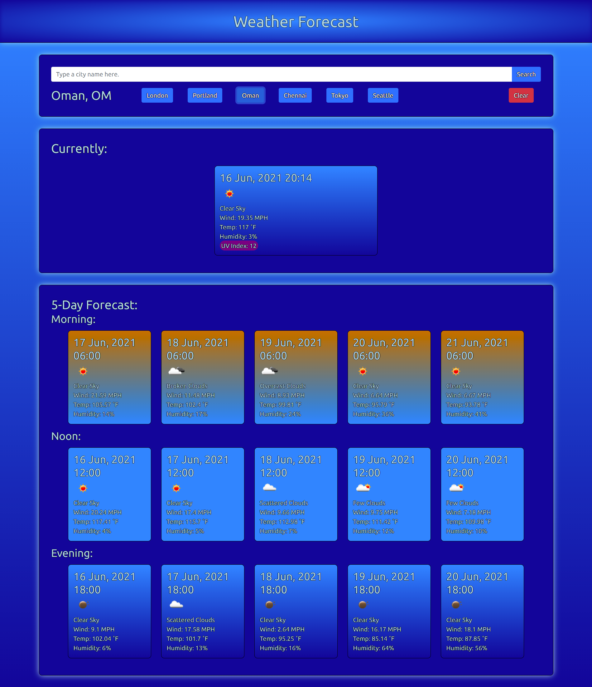

# 5-Day-Forecast-Homework-Week-6
## UofO Coding Bootcamp Homework for Week 6

### The Function of this website is to look up the current weather and a 5 Day forecast in any given city. You can also retrieve recent searches for faster use. 
### The website can be accessed here: https://reidk361.github.io/5-Day-Forecast-Homework-Week-6/

> **1920p width screen example.**   

> **Note: Appearance will change based on screen resolution.** 
